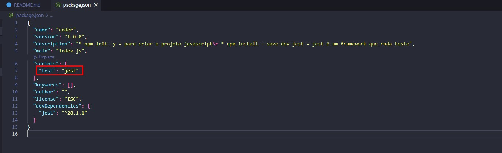
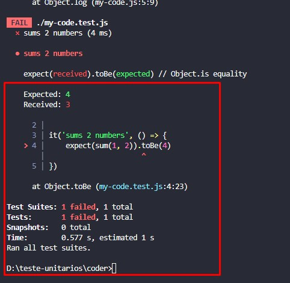
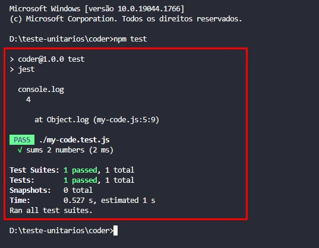
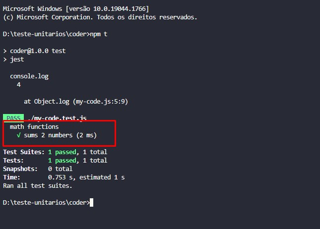
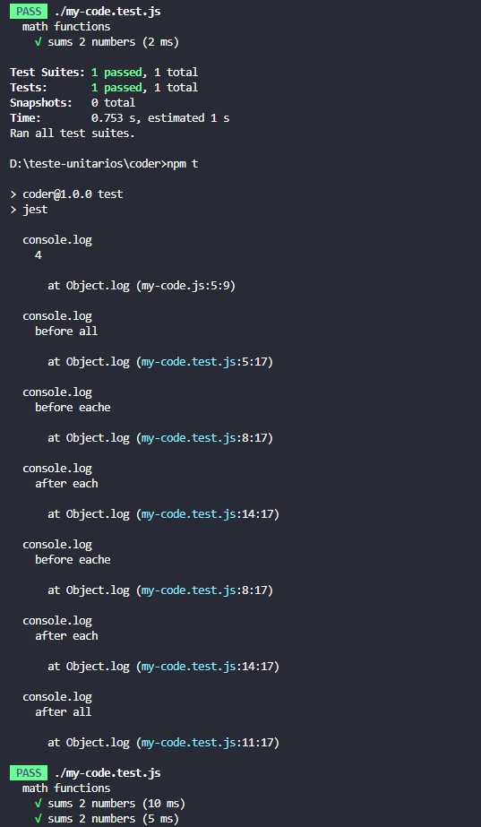
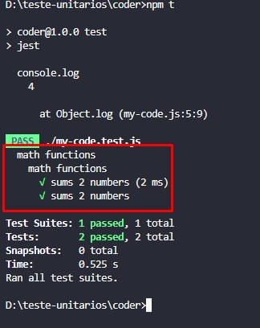
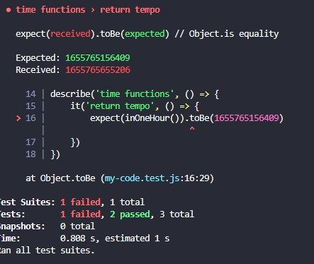
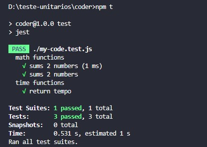
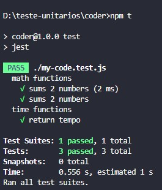

# Teste Unitário MOCK JEST

* npm init -y = para criar o projeto javascript
* npm install --save-dev jest = jest é um framework que roda teste

No arquivo package.json no test, apagar o que ta escrito e colocar jest:

* O que é? é um teste automatizado que testa unidade de código.

Para termos exemplo, criei um arquivo my-code.js js e fiz uma função de soma e coloquei pra exportar:

        const sum = (a, b) => {
            return a + b
        }

        console.log(sum(2, 2))

        module.exports = {sum} ou apenas sum

E depois pra testar criamos outro arquivo, colocamos mesmo nome para ficar melhor entendimento: sempre colocar test, arquivo ficou my-code.test.js
Para rodarmos esse test jest no terminal, são três comandos
* npm t
* npmt test
*npm run

no arquivo test, colocamos uma funcão assim com it:

                it('sums 2 numbers', () => {
            
                 })

O it é do jest 
Criamos so uma arrow function de teste que soma;

Exportamos nossa função sum pro arquivo de teste:

        const { sum } = require('./my-code.js')

Dentro da função it, chamamos o metodo expect = pra checar se a soma, se a expectativa tem que ser por exemplo 4. Fica dessa maneira:

            const { sum } = require('./my-code.js')

            it('sums 2 numbers', () => {
                expect(sum(1, 2)).toBe(4)
            })
 Ou posso importar assim:

            const sum = require('./my-code.js')

            it('sums 2 numbers', () => {
                expect(sum.sum(2, 1)).toBe(3)
            })

Então ao executar npm t para testar, ele vai informar que o teste não saiu com resultado que você queria e algo ta errado.

E quando da certo, fica verde os teste:

Outro detalhe que podemos fazer, vamos colocar mais uma função pra teste, pra organizar melhor testar as funções utilizamos o `describe`:

        const { sum } = require('./my-code.js')

        describe('math functions', () => {
            it('sums 2 numbers', () => {
                expect(sum(1, 2)).toBe(3)
            })
        })

O teste fica organizado: 

O describe ele agrupa as funções.
Vamos colocar beforeAll = antes de todos os testes eu posso fazer alguma coisa.
b  eforeAll é antes de todos esses caras que eu colocar dentro do meu teste

beforeEach = faz antes de cada um

Tem AfterAll quando acabar todos os testes podemos fazer alguma coisa(mensagem)

aftereach.

        const { sum } = require('./my-code.js')

        describe('math functions', () => {
            beforeAll(() => {
                console.log('before all')
            })
            beforeEach(() => {
                console.log('before eache')
            })
            afterAll(() => {
                console.log('after all')
            })
            afterEach(() => {
                console.log('after each')
            })
            it('sums 2 numbers', () => {
                expect(sum(1, 2)).toBe(3)
            })
            it('sums 2 numbers', () => {
                expect(sum(2, 2)).toBe(4)
            })
        })

Com esses caras eu consigo setar o terreno e limpar o terreno:

No terminal executando npm t sai assim:

Consiguimos também alinhar describes - corganizar com describes

    const { sum } = require('./my-code.js')

    describe('math functions', () => {
        describe('math functions', () => {
        it('sums 2 numbers', () => {
            expect(sum(1, 2)).toBe(3)
        })
        it('sums 2 numbers', () => {
            expect(sum(2, 2)).toBe(4)
        })  
        })
    })

Como isolar o teste ainda mais com jest? 

* Crio na mesmo arquivo outra função.

        const inOneHour = () => {

            const now = Date.now()
            const oneHourInMili = 1 * 60 * 60 * 1000
            return now + oneHourInMili
        }

        console.log(inOneHour())

        console.log(inOneHour())

        module.exports = {sum, inOneHour}

No console logo, os valores vai mudar porque eu não tenho controle do `Date.now()` e no teste unitário tem que ser feito com o valor exato no toBe.

Para testar unitario eu tiro o dat.Now e coloco um valor fixo, lembrando que o teste unitario é garantir que estamos testando a unidade. Quem testa o date now é o teste unitário do date now. Isso vale pra qualquer depedencia.

            const now = 10

    
Vamos de teste e coloco assim no meu arquivo de teste, futuramente, tem que ser diferente os arquivos.

    const { sum, inOneHour} = require('./my-code.js')

    describe('math functions', () => {
        it('sums 2 numbers', () => {
            expect(sum(1, 2)).toBe(3)
        })
        it('sums 2 numbers', () => {
            expect(sum(2, 2)).toBe(4)
        })  
    })

    describe('time functions', () => {
        it('return tempo', () => {
            expect(inOneHour()).toBe(1655765156409)
        })
    })

So que vai da erro, confere a seguir:

Isso por que o data.now ta la ativo nunca vai ser o mesmo, tem que restringir

Podemos fazer assim no arquivo de teste:

        describe('time functions', () => {
            it('return tempo', () => {
                global.Date.now = () => 0
                expect(inOneHour()).toBe(1655765156409)
            })
        })

        * O global.Date.now = () => 0 desse jeito, na hora de rodar o teste visualizamos que congelamos o valor

Podemos ver o resultado congelado, seria mesma coisa que eu fosse na minha função em js e colocar no lugar de date now o 0, assim: `const now = Date.now()`

Então fazemos assim:

        describe('time functions', () => {
            it('return tempo', () => {
                global.Date.now = () => 0
                expect(inOneHour()).toBe(3600000)
            })
        })

e o resultado:

* Ou na função podemos restringir:

        const inOneHour = () => {
            const now = 0
            const oneHourInMili = 1 * 60 * 60 * 1000
            return now + oneHourInMili
        }

E vemos abaixo o mesmo resultado:

Mas se chamamos  global.Date.now = () => 0 em qualquer lugar do codigo vai ficar travado no valor, a gente tem que retornar valor dele normal dps que usar.

E como vamos fazer isso?

` const realDateNow = Date.now.bind(global.Date`, e o que ele faz? Ele cria uma nova instancia, uma nova função do que eu passar aqui, nesse caso o Date e quando dou bind eu passo o valor atual do this, qual objeto de referencia de variaveis que ja existe la dentro que ele vai usar, vai ser o global.Date.
Posso modifcar o global.date.now e ai depois que terminei de resolver meus teste eu falo:
`global.Date.now = realDateNow`, eu congelo ele temporariamente pra fazer meu teste

        describe('time functions', () => {
            it('return tempo', () => {
                const realDateNow = Date.now.bind(global.Date)
                global.Date.now = () => 0
                expect(inOneHour()).toBe(3600000)
                global.Date.now = realDateNow
                console.log(global.Date.now())
            })
        })

Posso usar o jest.function exemplo:

        describe('time functions', () => {
            it('return tempo', () => {
                const realDateNow = Date.now.bind(global.Date)
                // global.Date.now = () => 0
                global.Date.now = jest.fn(() => 0)
                expect(inOneHour()).toBe(3600000)
                global.Date.now = realDateNow
                console.log(global.Date.now())
            })
        })

Quando usar teste unitario? Sempre é bom usar.

* Escrever o codigo, faça funcionar.
* Depois faça os testes unitário.

* ps: utilizamos o mock jest